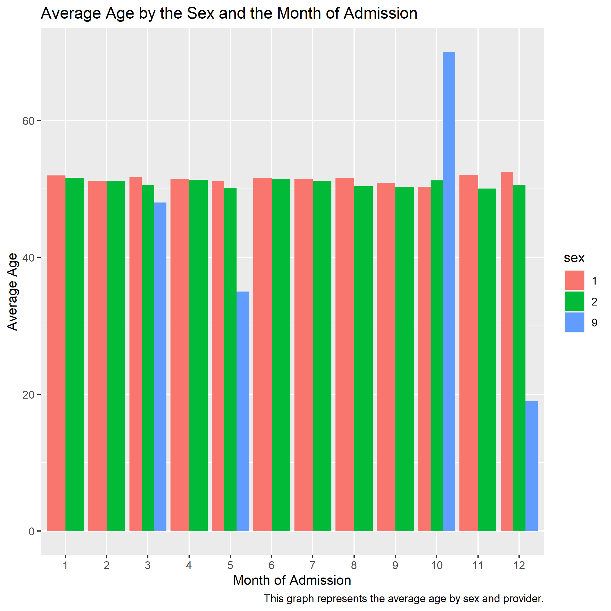
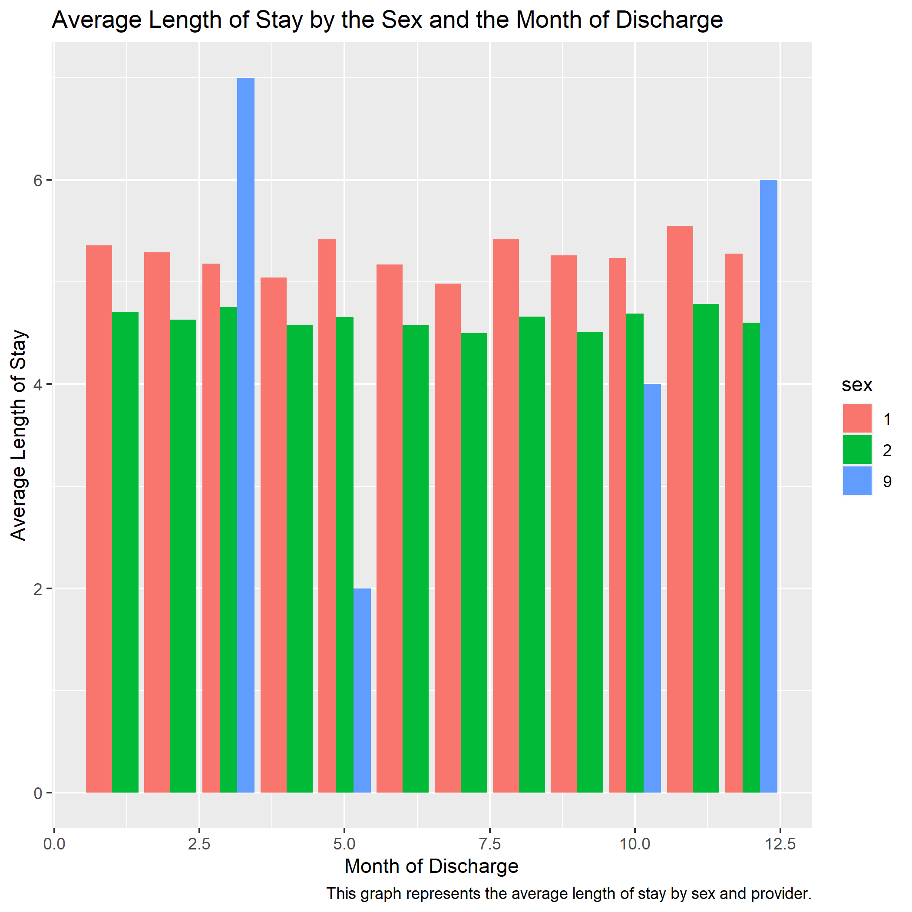
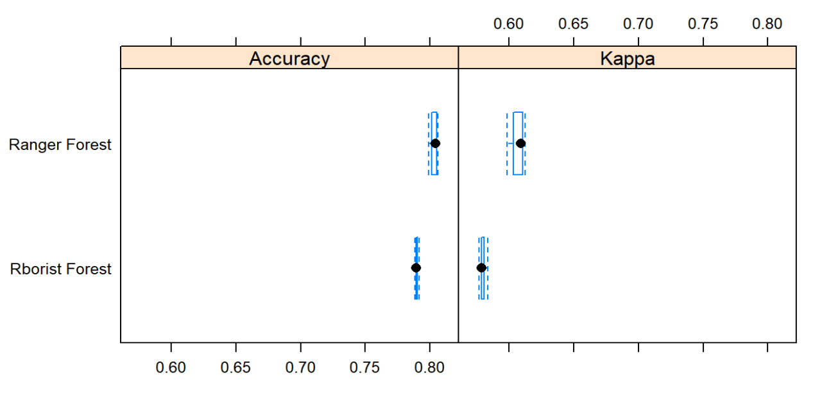

---
title: "Math421 Midterm"
author: Matt Lewitzky
output:
  xaringan::moon_reader:
    lib_dir: libs
    nature:
      highlightStyle: github
      highlightLines: true
      countIncrementalSlides: false

---
# Plot 1

```{r setup, include=FALSE}
options(htmltools.dir.version = FALSE)
```

```{r xaringan-tile-view, echo=FALSE}
xaringanExtra::use_tile_view()
```


```{r xaringan-panelset, echo=FALSE}
xaringanExtra::use_panelset()
```

```{r, echo=FALSE}
xaringanExtra::use_webcam()
```

```{r xaringan-fit-screen, echo=FALSE}
xaringanExtra::use_fit_screen()
```


---
# Plot 2



---
# Plot 3


---
# Plot 4



---
# Plot 5


---
# Plot 6


---
# Plot 7


---
# Plot 8


---
# Plot 9


---
# Plot 10


---
# Animated Plot


---
class: inverse, middle, center

# Model Comparisons - First target variable
Total charge - high & low

---
# Comparison


---
class: inverse, middle, center

# Model Comparisons - Second target variable
Length of stay - high & low

---
# Comparison



---
# Challenges

-The whole project was challenging, but I fought through the adversity


-There was SO much data


-Struggled to make and read so many useful graphs


-Also needed help with save the plot images


-Had trouble creating the presentation since I had never done that before

